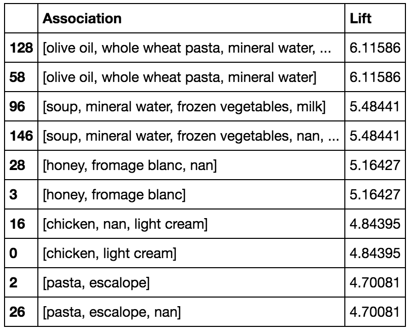
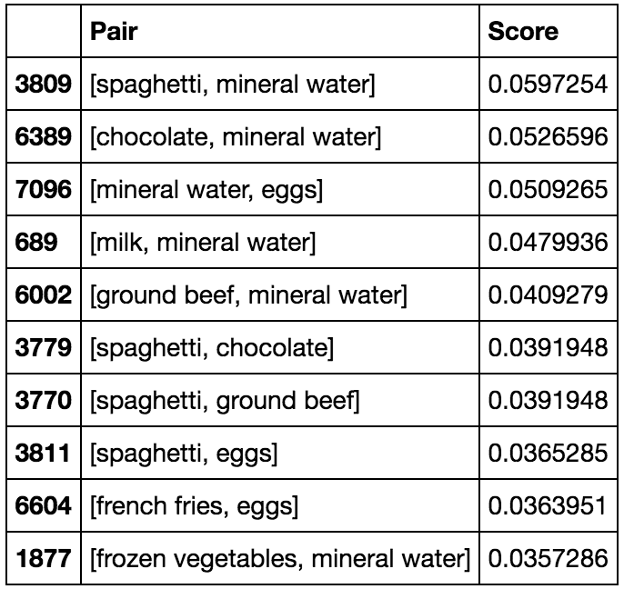

# Apriori and ECLAT application to build recommendation system (product allocation strategy)

Trained association rule models (Apriori and ECLAT) to find the most related items bought by customers of a french supermarket during a week. Each of 7501 lines on the dataset represent items that an unique customer bought during the week.

The dataset and code are based on a lecture from the course: Machine Learning A-Z™ by Kirill Eremenko https://www.udemy.com/machinelearning/learn/v4/overview. I modified the code to do some transformations and fit data into dataframes to make the visualization easier, and also developed ECLAT algorithm from scratch.

### Apriori:
This algorithm associate products preferences by most of the customers and can be used to generate products recommendation and help on displaying products strategy. 

### ECLAT: 
In this project I implemented the ECLAT algorithm by hand. It calculate the pairs that have been bought more frequently comparing to other pairs. At the end, we expect to see what is the most common combination of products during the week.

### Results:

#### Apriori: 
The table show the "lift" of every combination of products for Apriori algorithm. From the table we can see that the combination that lead to more "attractiveness power" is "olive oil", "whole wheat pasta" and "mineral water", meaning that if one of the products are picked, the likelihood of picking other products is higher. It can be used by the market to position the products closer (or farther), depending on the sales strategy.

#### ECLAT:
ECLAT sort the most common combinations of all lists, not caring about how one item isolatedly can influence in the purchase of another. The score power shown in table below show those most picked products.

